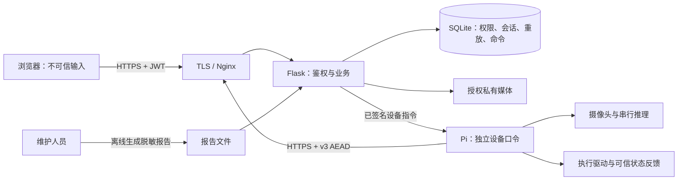
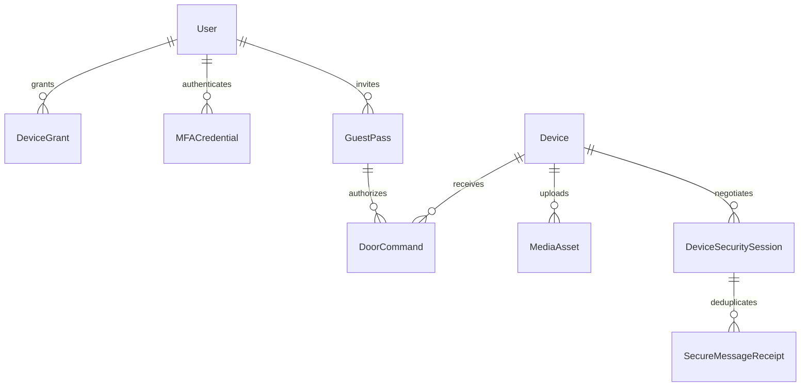
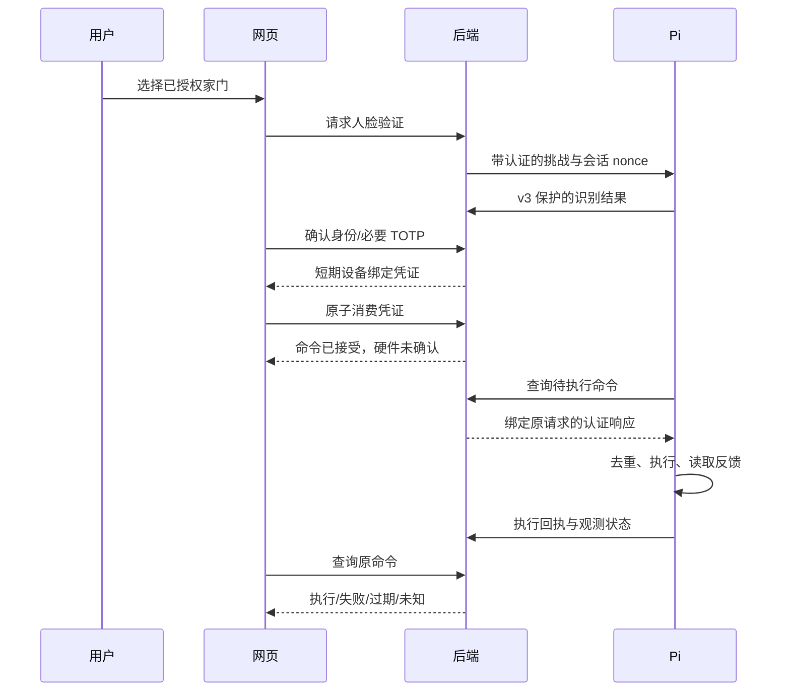
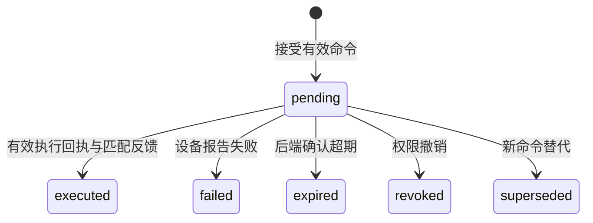

# 综合设计架构与威胁模型

本文件描述当前软件设计，硬件接入与 Pi 资源测量按 `HOME_DELIVERY.md` 的边界验收。需求编号为本项目自定义编号，不是学校评分表。

## 需求与实现映射

| 编号 | 需求 | 实现/验证入口 |
|---|---|---|
| R01 | 账户审批、密码和 TOTP 登录 | auth/mfa/accounts；认证回归与真实浏览器集成 |
| R02 | 授权设备和独立认证绑定 | permissions/access_management/door_auth；越权与撤销测试 |
| R03 | 人脸结果与短期授权 | mfa、设备识别；nonce/有效期/设备身份测试 |
| R04 | 控制接受、执行和状态分离 | door_commands/command_executor；回执、过期、重复与未知测试 |
| R05 | 访客期限、额度、撤销 | GuestPass/guestFlow；原凭证恢复与并发额度测试 |
| R06 | 私有画面与可信时间 | secure_receiver/video；授权图片、接收时间和代次测试 |
| R07 | 家居界面与可访问性 | features/shared；35 项宽度检查与 5 项文字放大检查 |
| R08 | 设备 AEAD、密钥确认、防重放 | smartlock_protocol/security_store；跨端、篡改、重启、并发用例 |
| R09 | 可重复部署与真实证据 | Compose/verify/package_release/backup；摘要、校验与只读报告 |

## 系统与信任边界

浏览器提交的角色、设备 ID、认证通过标记都不能成为授权依据。设备身份来自握手凭据与认证信封。数据库是多 worker 之间的唯一重放与命令事实来源。网页不访问私钥与人脸模板目录，也不能启动任意命令。远程设备指令的 HMAC 保护身份、路径、时间和内容；远程部署还需为设备服务配置受信 HTTPS，不把 HMAC 当隐私加密。

## 关键关系

图表达业务关系；设备 ID 与历史审计关联存在允许空值的兼容字段，不意味着旧记录自动具有外键完整性。

## 认证与开门时序

网络丢失时不重签发访客凭证，不把消息发送成功当作开门成功。命令状态机如下；网页观察超时是“未知”，不会凭本机时钟替后端判定已过期。

## 威胁与措施

| 威胁 | 实现措施 | 验证及剩余风险 |
|---|---|---|
| 绕过 MFA/角色伪造 | 逐请求检查审批、auth_version、有效 TOTP 凭据 | 旧 JWT、账户重审批、普通成员管理接口拒绝 |
| 跨设备开门 | DeviceGrant、认证绑定、凭证/会话设备关联 | 设备不匹配与撤销用例 |
| 篡改/跨端点重放 | GCM AAD 包含端点、方法、方向、版本和身份 | 密文/header 修改、错误方向/路径均拒绝 |
| 多 worker/重启重放 | 数据库唯一约束与独立提交重放凭据 | 并发仲裁与重启后的旧请求拒绝 |
| nonce 复用 | 新会话新密钥、锁内计数器、进程重启重新握手 | 1000 次并发唯一性；禁止恢复客户端旧密钥 |
| 协议降级/未确认密钥 | 明确版本、完整 transcript、双向确认、Compose 关闭 v2 | 客户端降级拒绝、pending 业务拒绝 |
| 访客超额与响应丢失 | 原子额度、原凭证结果查询、不自动重验 | 并发与丢失响应回归 |
| 图片泄露/伪造现场 | 私有目录授权读取、内容验证重编码、空状态 | 越权路径拒绝；截图/接收时间不证明现场真实性 |
| 模型并发和内存耗尽 | 单 worker、两线程、串行推理/模板更新、有限 backlog | 软件资源锁测试；真实 Pi RSS/温度待测 |
| 假执行/未知重试 | 执行回执与反馈分开，保留未知原命令 | 未配置驱动不伪造确认；真实传感器需接入 |

## 设计决定

- ADR-01：日常使用与管理证据分层，共享业务和权限；解决单设备家居界面被企业统计淹没的问题。
- ADR-02：保留 Vue/Vite/Flask/SQLite 单系统，按领域拆分源码；暂不引入微服务、网关平台或消息集群。
- ADR-03：使用 AES-GCM 替代默认 CBC+HMAC 信封，保持 v2 可显式对照；双端从同一源码包发布，禁止自动降级。
- ADR-04：服务端持久会话与重放凭据，客户端重启重新握手；避免从零恢复同一密钥的 nonce 计数器。
- ADR-05：只读展示真实配置和脱敏离线报告；攻击测试在隔离数据库/离线环境运行，不提供生产攻击按钮。
- ADR-06：Pi 负责采集、识别与执行，后端和浏览器在电脑；不对 2 GB 板使用未经测量的共机部署。

限制：python-spake2 的常数时间保证不足；当前模型没有经过本项目人员、光照、攻击样本的 FAR/FRR 或活体安全评估；工业级认证、抗照片攻击和硬件执行安全都不能靠 UI 或算法列表宣布完成。
